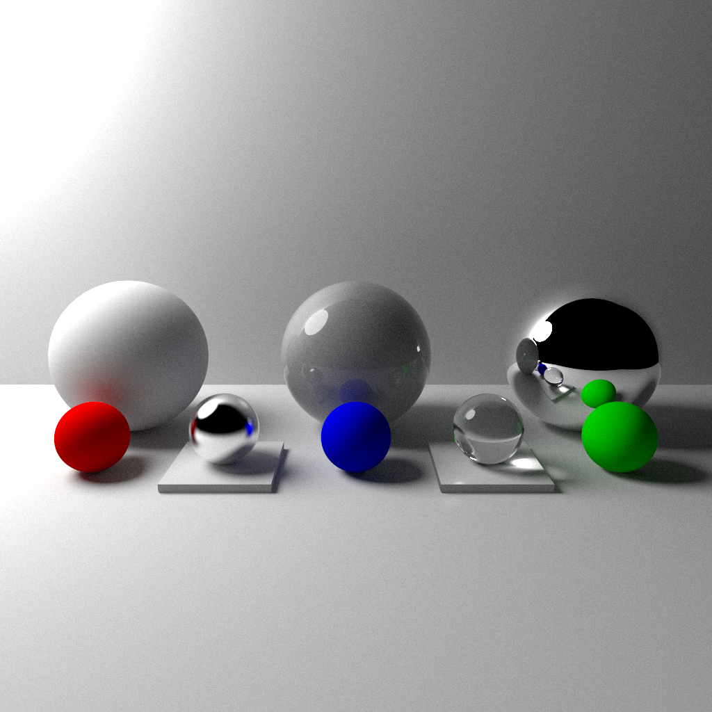

# Ray Tracing 

.

Inspired by Peter Shirley's [book series](https://raytracing.github.io) about ray tracing.

The way that light interacts with matter and shapes the way we see and experience our world is fascinating. The beauty of ray tracing is that it is only based on the physical processes of light-matter interactions. I studied coherent light interactions in detail during my [bachelor's thesis](https://github.com/schulze-paul/BA-Thesis). However the simulations are very specialized to examine a specific effect and are not capable to render any images of 3D objects.

Working with this project, I was able to use many of the skills developed doing scientific computing and get a very visually appealing result.

## Python / Cython Implementation
I started the implementation in Python with Numpy: 
- I created a custom Python extension in C++ using Cython to handle handlevector operations, reflections, refractions and hit detection.
- Using the multiprocessing library, I sped up the execution further.

## C++ Implementation
Not satisfied with the result, I ported the whole project to C++, and implemented additional features:
- Axis-aligned bounding boxes: Hit detection is sped up by first checking if a ray hits the bounding box containing the object.
- Bounding volume hierarchy nodes: The scene is split into a tree of bounding boxes, which are then traversed to find the closest hit.
- Probability Distribution functions: The rays are distributed according to a cosine distribution to simulate diffuse reflection. Light sources are sampled according to their intensity to reduce noise.

## Input files

The scene is described in a YAML file, which is parsed with the help of the [yaml-cpp](www.github.com/jbeder/yaml-cpp) library. It contains objects, materials, light sources and the camera setup. The objects and camera are loaded dynamically at runtime.

```yaml
scene:
  camera:
    look_from: [8, 3, 0]
    look_at: [1.5, 0.5, 1.4]
    vup: [0, 1, 0]
    vfov: 10
    aperture: 0.0
    aspect_ratio: 1.0
    focal_length: 10.0
    image_width: 200
    samples_per_pixel: 1024
    time0: 0.0
    time1: 1.0
    
  objects:
    # rectangle as ground
    - type: xz_rectangle
      x0: -10
      x1: 10
      z0: -10
      z1: 10
      k: 0
      material:
        type: diffuse
        color: [1.0, 1.0, 1.0]

    # diffuse sphere on the left
    - type: sphere
      center: [-3, 1, 0]
      radius: 1
      material:
        type: diffuse
        color: [1.0, 1.0, 1.0]

    # metal sphere on the right
    - type: sphere
      center: [3, 1, 0]
      radius: 1
      material:
        type: metal
        albedo: [1.0, 1.0, 1.0]
        fuzz: 0.0

    # white sphere with glossy reflection in the middle
    - type: sphere
      center: [0, 1, 0]
      radius: 1
      material:
        type: dielectric
        refraction_index: 1.5
    - type: sphere
      center: [-0, 1, 0]
      radius: 0.99
      material:
        type: diffuse
        color: [1.0, 1.0, 1.0]
```

## Spectral Rendering
I am working on a spectral renderer, which simulates the wavelength-dependent behaviour of light. This is useful for simulating the appearance of materials like glass, water or metals. The spectral color is represented by a 81 dimensional vector, which is sampled at 81 wavelengths between 380nm and 780nm.

The spectral data is converted to XYZ color space using the CIE 1931 2 degree standard observer. The XYZ color is then converted using the CIE XYZ to sRGB conversion matrix. The sRGB color is then gamma corrected to get the final color.

Dispersion is simulated by using a different refractive index for each wavelength. The refractive index for a given ray with wavelength λ is calculated using the Sellmeier equation.


